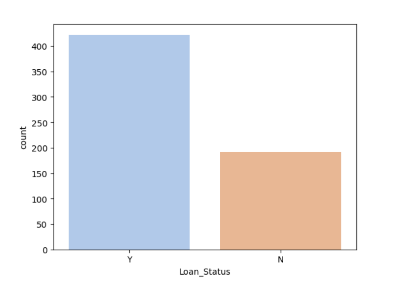
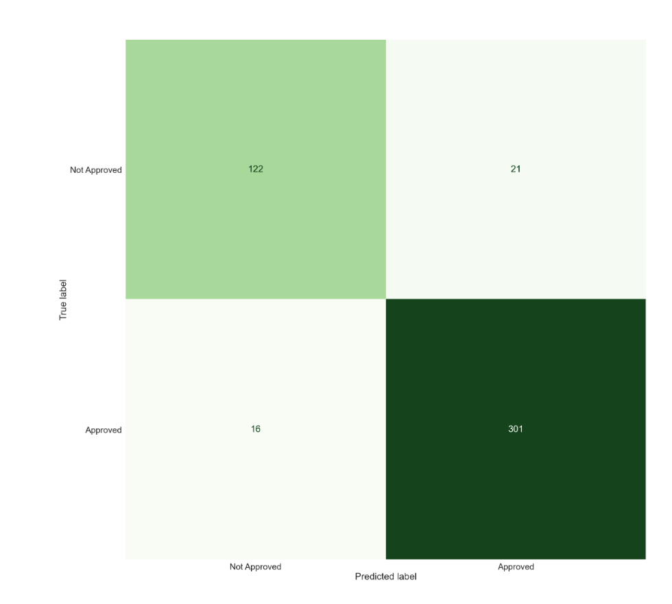

# Predicting Loan Approvals Using Machine Learning

## <b>Overview</b>
This project uses Machine Learning (ML) to make predictions on a binary classification target for a loan company. The models created are looking to predict whether someone should be approved for a loan or not.

## <b>Business Problem</b>
A private loan company is interested in automating the loan approval process. It can take a lot of resources to check through each criteria to give approval so they would like a solution that will achieve these results. This also has the potentional to be integrated into their online options to have further reach. 

## <b>Data Extraction</b>
The dataset used in this project was downloaded from kaggle. The information can be downloaded [here](https://www.kaggle.com/datasets/burak3ergun/loan-data-set) or through this repository. The dataset included 614 rows and 13 columns. The columns were:
 * Loan_ID
 * Gender
 * Married
 * Dependents
 * Education
 * Self_Employed
 * ApplicantIncome
 * CoapplicantIncome
 * Loan_Amount
 * Loan_Amount_Term
 * Credit_History
 * Property_Area
 * Loan_Status

## <b>Exploratory Data Analysis</b>
Before modeling, it is important to understand what the story of the data is. Are there any class imbalances with the target? Are there correlated features? What are the percentages of the values in the information? With visualizations and analysis, we can have insights that give based on historical data.

### <h2 align="center"><b><u>Insight 1</b></u></h2> 
#### <h3 align="center"><b>Loan Status</b></h3>

##### 
There is class imbalance in the target. This indicates for the future in modeling that we may need tro process the data for modeling. Also, the percentage of approvals was ~68.7% while the percentage of disapprovals was ~31.3%. More people were approved in this dataset than those who were not.

### <h2 align="center"><b><u>Insight 2</b></u></h2>
#### <h3 align="center"><b>Applicant Income vs Loan Status</b></h3>


When Loan Status is plotted along with Applicant Income, it shows that while the mean of the approvals and disapprovals hover in a lower amount, there are lots of outliers for both and the distributions are skewed.

### <h2 align="center"><b><u>Insight 3</b></u></h2>
#### <h3 align="center"><b>Property Area vs Loan Status</b></h3>

Property Area plotted with Loan Status displays the fact that in any particular area, approval rates were higher than disapproval rates. However, approval rates in the suburban area were much higher than in urban and rural areas. Furthermore, disapproval rates in the suburban area were also the lowest of the 3 areas.

### <h2 align="center"><b><u>Insight 4</b></u></h2>
#### <h3 align="center"><b>Credit History</b></h3>

There is a huge imbalance in credit history as well. The percentage of people who have a credit history is ~77.4%. This fact did play a significant role in the modeling discussed later in this README.

## <b>The Modeling Process</b>
### <b>Preprocessing</b>
In this dataset, there were preprocessing steps that needed to be address. Included are both categorical features and numerical features. The way to preprocess this information is different. There were missing values as well in some of the features which needed to be taken care of. We know that our target (Loan Status) is a binary classification so it needed to mapped to numerics as the algorithms in the machine learning libraries used do not support the intake of strings.

Pipelines using sklearn were created to build a flow for the data to process. A pipeline for the categorical features had a simple imputer that filled in the missing values with the most frequent value as the data was skewed. It was followed by a One Hot Encoder to encode the cateorical features. The pipeline for the numerical columns had a simple imputer as well. Following was Standard Scaler which took the features and put them into a range that would be easier for the ML tasks to process.

After these pipelines were finished, they were inputted into a column transformer. The data was split into training and test sets for modeling.

### <b>Modeling</b>
3 models were used to accomplish the prediction task. These were:
* Logistic Regression
* Random Forest
* XGBoost

The processed was iterated through 2 ways:

<b>First Iteration</b>

Each model type started with a pipeline that included the column transformer that had the preprocessing steps and the model with the default hyperparameters. Class weights were set in the model parameters to deal with the target class imbalance. For XGBoost though, weights had to be calculated and set by the scale_pos_weight parameter. Random states were set into the models reproduce results.

<b>Second Iteration</b>

Each model type started with a pipeline that included the column transformer that had the preprocessing steps and the model with the default hyperparameters. Class weights were set in the model parameters to deal with the target class imbalance. For XGBoost though, weights had to be calculated and set by the scale_pos_weight parameter. Random states were set into the models reproduce results. 

A parameter grid was created with different hyperparametic features and different values in those features. The pipeline and the parameter grid were then inputted into a GridSearchCV with cross validation folds of 5 to find the best model to use.


## <b>The Evaluation Process</b>
Supervised learning has ground truth labels where the predictions can be evaluated against. Each model made a prediction on the test set and had a cross validation. Based on these factors, the best model was chosen. 

These were the results of each model on the train set:

### <b><u>Baseline Logistic Regression</b></u>
<b>Cross validation score:</b> ~75.8

### <b><u>Logistic Regression with Gridsearch</b></u>
<b>Cross validation score:</b> ~81.5

### <b><u>Baseline Random Forest</b></u>
<b>Cross validation score:</b> ~80.4

### <b><u>Random Forest with Gridsearch</b></u>
<b>Cross validation score:</b> ~83.2

### <b><u>Baseline XGBoost</b></u>
<b>Cross validation score:</b> ~76.7

### <b><u>XGBoost with Gridsearch</b></u>
<b>Cross validation score:</b> ~92.0



## <b>The Conclusion</b>
The final model chosen was the XGBoost model with Gridseach. It did not perform better than the Random Forest or even the Logistic Regression model in terms of the approved category. RF and LR outperformed the XGB model by ~10% in terms of approved applications. The XGB model did however, outperform both models in terms of the not approved category. In terms of business, it is much more of a risk to give out loans to people who are not supposed to be approved. The XGBoost model was the only model that had more than a 50% success rate at filtering the not approved applications.

## <b>The Application</b>
Streamlit was used to build a prototype website of the model in action.

<div style="position: relative; padding-bottom: 62.5%; height: 0;"><iframe src="https://www.loom.com/embed/f3a515d55a444c5b87cc1134a4630f85" frameborder="0" webkitallowfullscreen mozallowfullscreen allowfullscreen style="position: absolute; top: 0; left: 0; width: 100%; height: 100%;"></iframe></div>

## <b>For More Information</b>
See the full analysis in the Jupyter Notebook or review this presentation:

[Modeling Notebook](/loan_approval_notebook.ipynb)


## <b>References</b>


### Exploratory Analysis

[Loan Prediction w/ Various ML Models](https://www.kaggle.com/code/diandraawangga/loan-prediction-w-various-ml-models)

## <b>Additional Info</b>
For additional info, contact Jonathan Roman at [jonathan.roman1213@gmail.com](mailto:jonathan.roman1213@gmail.com)

## <b>Repository Structure</b>
```
├── data
├── images
├── .gitignore
├── README.md
├── environment.yml
├── finalized_loan_model.pkl
├── loan_approval_notebook
└── loan_approvals_py.py
```

